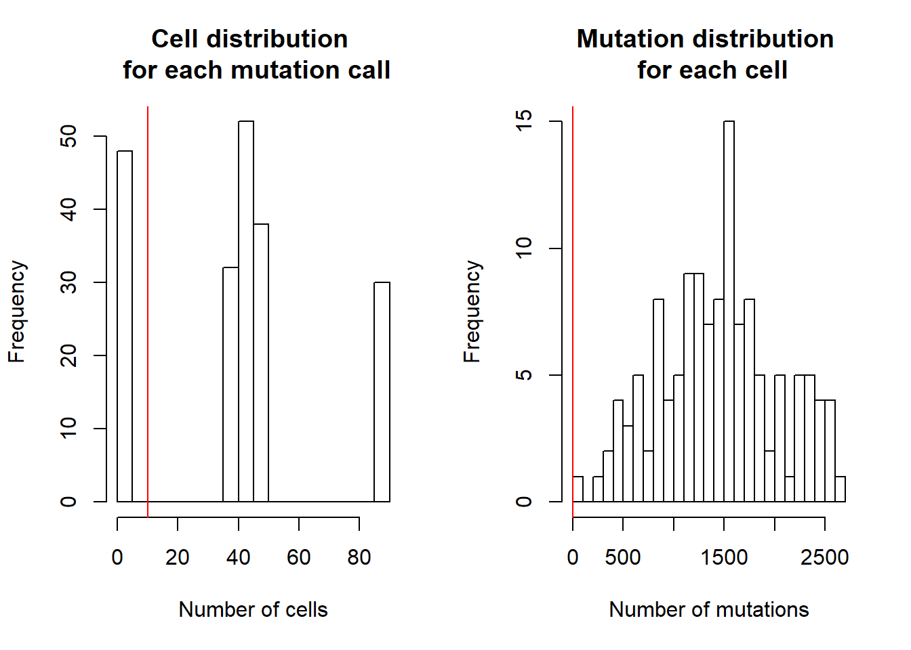
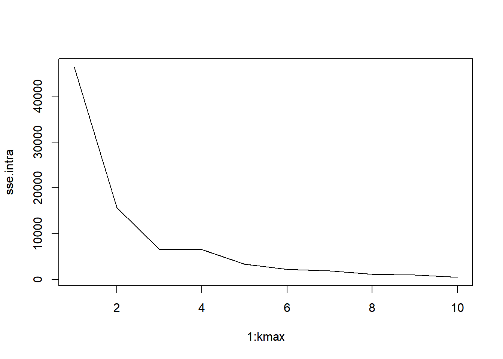
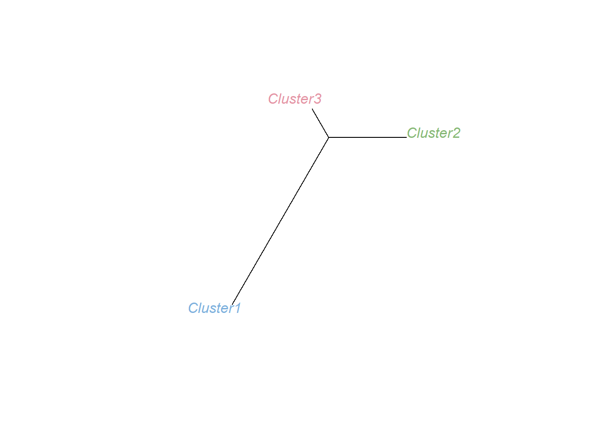

# 1. Installation
Install all packages in the latest version of [R](https://www.r-project.org/).

```r
devtools::install_github("zhouzilu/DENDRO")
```

# 2. Questions & issues
If you have any questions or problems when using DENDRO, please feel free to open a new issue [here](https://github.com/zhouzilu/DENDRO/issues). You can also email the maintainers of the package -- the contact information is below.

* [Zilu Zhou](https://statistics.wharton.upenn.edu/profile/zhouzilu/) (zhouzilu at pennmedicine dot upenn dot edu)
  <br>
  Genomics and Computational Biology Graduate Group, UPenn

* [Nancy R. Zhang](https://statistics.wharton.upenn.edu/profile/nzh/) (nzh at wharton dot upenn dot edu)
  <br>
  Department of Statistics, UPenn

# 3. DENDRO analysis pipeline
## 3.1 Overall pipeline 

Figure 1 illustrate the overall pipeline. DENDRO starts from scRNA-seq raw data. We recommend STAR 2-pass method for mapping because it is more robust with splicing junction. SNA detection was applied to mapped BAM files. Both counts of total allele reads and counts of alternative allele reads for each cell c at mutation position g are collected. In the next step, a cell-to-cell genetic divergence matrix is calculated using a genetic divergence evaluation function. DENDRO further clusters the cells and polls cells from same cluster together and re-estimate SNA profiles. Based on the re-estimated SNA profiles, DENDRO generates a parsimony tree which shows the evolution relationship between subclones.


  **Figure 1**. A flowchart outlining the procedures for DENDRO. We separate our analysis pipeline into three stages. The subtask is labeled on the right.

## 3.2 Stage I
### 3.2.1 Initial SNA detection with GATK

Starting with scRNA-seq dataset, we first detect primary mutation with GATK tools. Due to large amount of cells, a map-reduce GVCF approach is necessary. An example script is attached [here]{www.rstudio.com}. After generated the VCF files, DENDRO extract information of (1)number of alternative allele read counts $X$, (2) number of total allele read counts $N$, and (3) mutation profile matrix $Z$, where $Z=1$ indicates mutations  for each cell and loci. $X, N, Z \in R^{M \times C}$. $M$ is total number of mutation loci and $C$ is total number of cells.

Here we load our demo dataset generated using spike-in.

```r
library(DENDRO)
data("DENDRO_demo")
str(demo)
#> List of 5
#>  $ X    : int [1:200, 1:130] 0 0 0 0 0 0 0 0 0 13 ...
#>  $ N    : int [1:200, 1:130] 0 0 0 0 0 4 0 0 4 13 ...
#>  $ Z    : num [1:200, 1:130] 0 1 0 0 0 0 0 1 0 1 ...
#>  $ label: int [1:130] 2 3 2 3 2 1 1 2 2 3 ...
#>  $ Info :'data.frame':	200 obs. of  4 variables:
#>   ..$ #CHROM: chr [1:200] "chr2" "chr16" "chr6" "chr5" ...
#>   ..$ POS   : int [1:200] 181856031 2303284 73428614 112211786 120692337 125748791 58364166 154313322 51631588 73388675 ...
#>   ..$ REF   : chr [1:200] "T" "T" "T" "T" ...
#>   ..$ ALT   : chr [1:200] "G" "A" "C,*" "C" ...
#>   ..- attr(*, ".internal.selfref")=<externalptr>
```

where `Info` indicates mutation information such as chromosome, allele nucleitide and position, and `label` indicates the true label, which we don't have in a real data analysis.

### 3.2.2 Cell and mutation filtering 

Given $X, N$ and $Z$, DENDRO first apply qc


```r
demo_qc = FilterCellMutation(demo$X,demo$N,demo$Z,demo$Info,demo$label)
#> Number of calls in more than 10 190  cells and less than  190  cells:  152  out of  200
#> Number of cells with more than 0  and less  4371  total read counts:  130
```



The above two plots illustrate two distributions: (left) total number of cells for each mutations and (right) total number of mutations for each cell.


```r
str(demo_qc)
#> List of 5
#>  $ N    : int [1:152, 1:130] 0 0 0 0 4 0 4 13 0 0 ...
#>  $ X    : int [1:152, 1:130] 0 0 0 0 0 0 0 13 0 0 ...
#>  $ Z    : num [1:152, 1:130] 0 1 0 0 0 1 0 1 1 0 ...
#>  $ Info :'data.frame':	152 obs. of  4 variables:
#>   ..$ #CHROM: chr [1:152] "chr2" "chr16" "chr6" "chr10" ...
#>   ..$ POS   : int [1:152] 181856031 2303284 73428614 120692337 125748791 154313322 51631588 73388675 141506144 82340585 ...
#>   ..$ REF   : chr [1:152] "T" "T" "T" "A" ...
#>   ..$ ALT   : chr [1:152] "G" "A" "C,*" "G" ...
#>   ..- attr(*, ".internal.selfref")=<externalptr> 
#>  $ label: int [1:130] 2 3 2 3 2 1 1 2 2 3 ...
```


## 3.3 Stage II
### 3.3.1 Genetic divergence matrix calculation

Now can calculate the genetic divergence matrix.


```r
demo_qc$dist = DENDRO.dist(demo_qc$X,demo_qc$N,demo_qc$Z,show.progress=FALSE)
```

### 3.3.2 Clustering based on genetic divergence matrix

Let's apply hierachical clustering and plot out the clustering result colored by known true label: `demo_qc$clade`


```r
demo_qc$cluster = DENDRO.cluster(demo_qc$dist,label=demo_qc$label)
```


Let's decided the optimal number of clusters


```r
demo_qc$sse = DENDRO.sse(demo_qc$dist,demo_qc$cluster)
```



```r
demo_qc$optK = 3
demo_qc$DENDRO_label = cutree(demo_qc$cluster,demo_qc$optK)
```

We decide this by identify kink or "elbow point". In this example, `optK = 3`. It is crucial that if there are multiple "elbow point", the smallest one is the most robust.

Let's re-plot our data with DENDRO label


```r
demo_qc$cluster = DENDRO.cluster(demo_qc$dist,label=demo_qc$DENDRO_label)
```


### 3.3.3 Re-estimate mutation profile within each cluster and QC


```r
demo_cluster = DENDRO.recalculate(demo_qc$X,demo_qc$N, demo_qc$Info, demo_qc$DENDRO_label, cluster.name=c('Cluster3','Cluster2','Cluster1'))
#> Before QC, there are total  152  mutations across  3  subclones 
#> After QC, there are total  68  mutations across  3  subclones
```
cluster.name specify the cluster name given the clustering order

## 3.4 Stage III
### 3.4.1 Evolutionary tree construction


```r
DENDRO.tree(demo_cluster$Z)
```



In this phylogenetic tree, Cluster1 have greater genetic divergences compared with Cluster2 and Cluster3, which is consistent with our data generation process. 

### 3.4.2 Other analysis

User could further perform joint differential expression analysis and differential mutation analysis between different subclone groups. Mutation profile across clones is at `demo_cluster$Z`.

Differential mutation analysis packages are wide-spread. Two methods that I personally prefer are [Seurat MAST implementation](https://satijalab.org/seurat/get_started.html) and [scDD](https://bioconductor.org/packages/release/bioc/html/scDD.html).

Gene set enrichment analysis is available at [MSigDB, Broad Institute](http://software.broadinstitute.org/gsea/msigdb/).


# 4. Session info


```r
sessionInfo()
#> R version 3.4.1 (2017-06-30)
#> Platform: x86_64-w64-mingw32/x64 (64-bit)
#> Running under: Windows 10 x64 (build 10240)
#> 
#> Matrix products: default
#> 
#> locale:
#> [1] LC_COLLATE=English_United States.1252 
#> [2] LC_CTYPE=English_United States.1252   
#> [3] LC_MONETARY=English_United States.1252
#> [4] LC_NUMERIC=C                          
#> [5] LC_TIME=English_United States.1252    
#> 
#> attached base packages:
#> [1] stats     graphics  grDevices utils     datasets  methods   base     
#> 
#> other attached packages:
#>  [1] DENDRO_0.1.0     ggplot2_2.2.1    mclust_5.4       phyclust_0.1-22 
#>  [5] colorspace_1.3-2 svMisc_1.1.0     phangorn_2.4.0   ape_5.0         
#>  [9] dendextend_1.8.0 TailRank_3.2.1   oompaBase_3.2.6 
#> 
#> loaded via a namespace (and not attached):
#>  [1] modeltools_0.2-21   kernlab_0.9-25      lattice_0.20-35    
#>  [4] oompaData_3.1.1     htmltools_0.3.6     stats4_3.4.1       
#>  [7] viridisLite_0.3.0   yaml_2.1.16         rlang_0.2.2        
#> [10] prabclus_2.2-6      BiocGenerics_0.24.0 fpc_2.1-11         
#> [13] plyr_1.8.4          robustbase_0.92-8   stringr_1.3.1      
#> [16] munsell_0.4.3       gtable_0.2.0        mvtnorm_1.0-7      
#> [19] evaluate_0.10.1     Biobase_2.38.0      knitr_1.17         
#> [22] flexmix_2.3-14      parallel_3.4.1      class_7.3-14       
#> [25] DEoptimR_1.0-8      trimcluster_0.1-2   Rcpp_0.12.18       
#> [28] scales_0.5.0        backports_1.1.0     diptest_0.75-7     
#> [31] gridExtra_2.3       fastmatch_1.1-0     digest_0.6.12      
#> [34] stringi_1.1.7       grid_3.4.1          rprojroot_1.2      
#> [37] quadprog_1.5-5      tools_3.4.1         magrittr_1.5       
#> [40] lazyeval_0.2.1      tibble_1.3.4        cluster_2.0.6      
#> [43] whisker_0.3-2       pkgconfig_2.0.1     MASS_7.3-47        
#> [46] Matrix_1.2-14       rmarkdown_1.8       viridis_0.5.0      
#> [49] nnet_7.3-12         igraph_1.1.2        nlme_3.1-131       
#> [52] compiler_3.4.1
```

# 5. References

